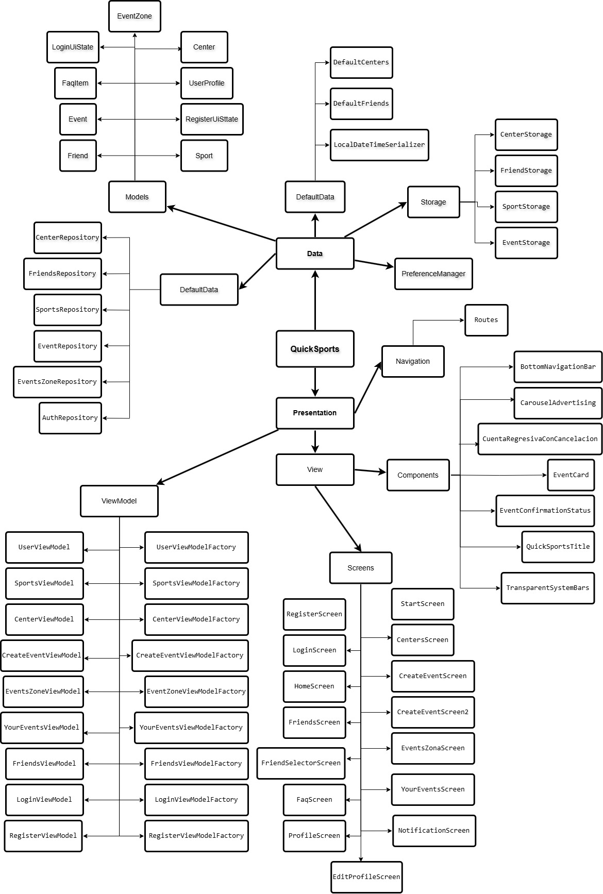
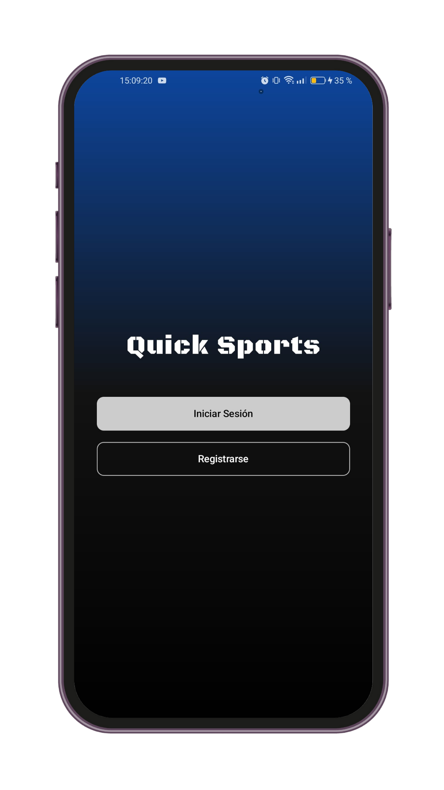
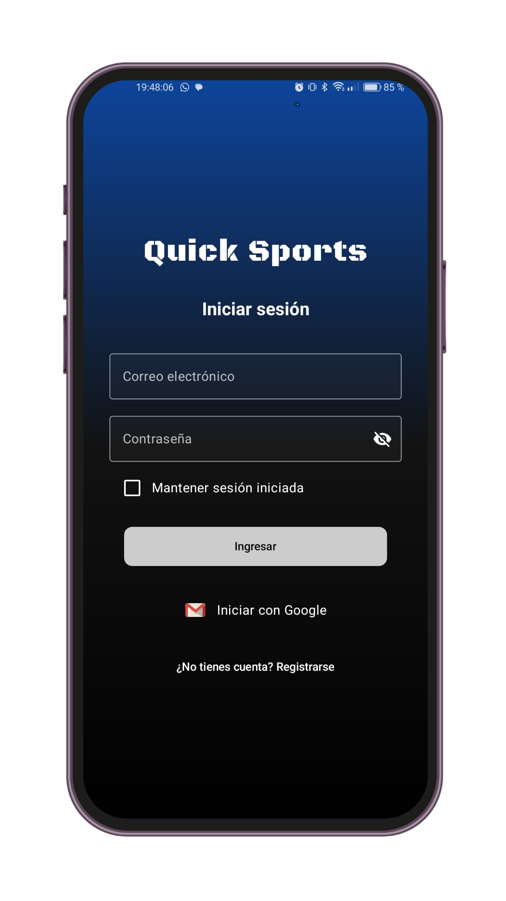
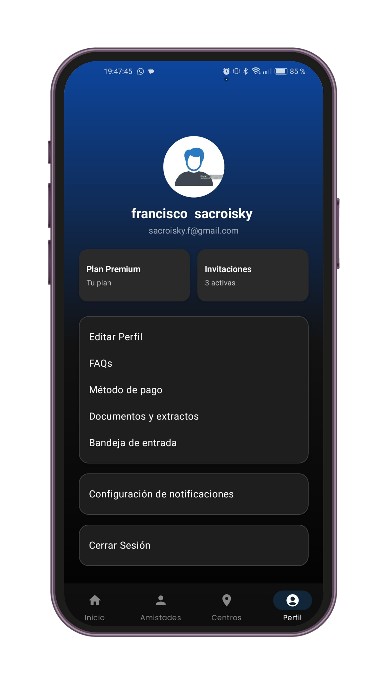
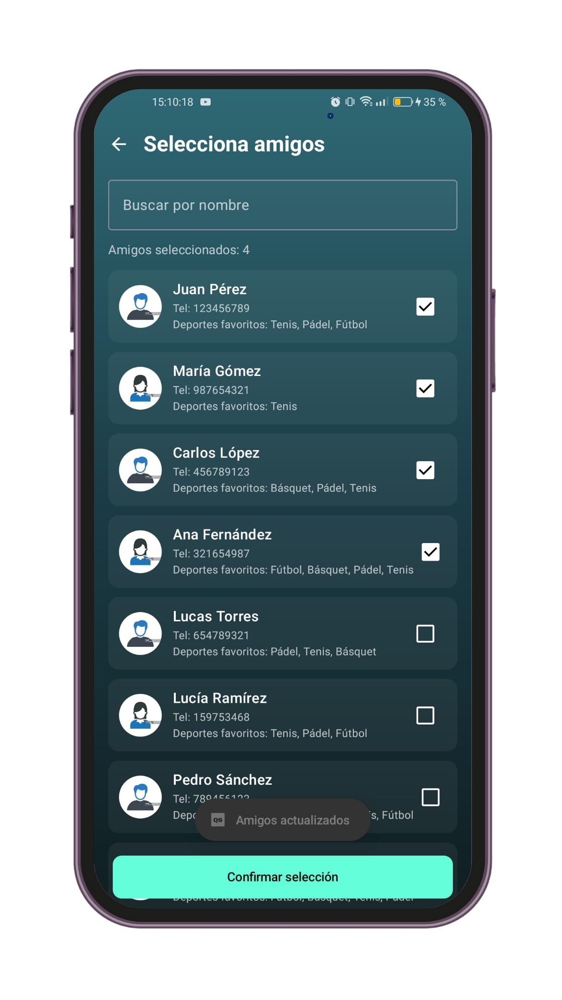

# QuickSports 🏀⚽🎾🏓

**QuickSports** is a mobile application developed in Kotlin using Jetpack Compose. It aims to make it easier to organize amateur sports matches in the city of Barcelona.  
The app connects users interested in sports like football, basketball, padel, and tennis, offering a smooth, intuitive experience focused on sports and community.

---

## 📱 Key Features

- User registration and login (Firebase Authentication).
- Create sports events: select sport, center, date, and invite friends.
- Public event listing by zone.
- Manage personal profile and favorite sports.
- Firebase cloud storage + local JSON persistence.
- Favorite centers and player organization system.

---

## 🧱 Technologies Used

- **Kotlin**
- **Jetpack Compose**
- **MVVM (Model-View-ViewModel)**
- **Kotlin Coroutines + MutableStateFlow**
- **Firebase Authentication**
- **Cloud Firestore**
- **Local storage with JSON files**
- **ViewModel + StateFlow for reactive state handling**

---

## 🗃️ Architecture

The project follows the **MVVM** pattern, with a clear separation of concerns:

- `ViewModel`: business logic and reactive state handling.
- `Repository`: data abstraction (local or remote).
- `Storage`: local persistence with `.json` files.
- `UI`: Composables and navigation between screens.

---

<p align="center">
  

</p>
---

## 🧠 State Management & Persistence
QuickSports uses a reactive architecture powered by StateFlow and ViewModel to ensure a smooth and consistent user experience.
Key data such as event creation, selected sport, and invited users remain stable even during configuration changes (e.g., screen rotation).
The app combines local persistence using JSON files with cloud storage via Firebase, ensuring both offline availability and real-time synchronization (in its initial phases).

---

## 🗺️ Future Improvements

- Upload user profile images to Firebase Storage.
- In-app messaging system between users.
- Map and geolocation integration.
- Dashboard for sports centers to manage requests.
- Player rating and behavior feedback.
- Online payments and reservations.

---

## 🚀 Installation

1. Clone the repository:

```bash
git clone https://github.com/yourusername/QuickSports.git
```
---
<p align="center">
  



</p>

---

# QuickSports  🏀⚽🎾🏓

**QuickSports** es una aplicación móvil desarrollada en Kotlin con Jetpack Compose, pensada para facilitar la organización de partidos deportivos amateurs en la ciudad de Barcelona.  
Permite conectar personas interesadas en deportes como fútbol, básquet, pádel y tenis, ofreciendo una experiencia fluida, intuitiva y centrada en la comunidad deportiva.

---

## 📱 Funcionalidades principales

- Registro e inicio de sesión de usuarios (con Firebase Authentication).
- Creación de eventos deportivos con selección de deporte, centro, fecha y amigos invitados.
- Visualización de eventos públicos por zona.
- Gestión del perfil personal y deportes favoritos.
- Almacenamiento de datos en Firebase y persistencia local con JSON.
- Sistema de favoritos y organización de centros deportivos.

---

## 🧱 Tecnologías utilizadas

- **Kotlin**
- **Jetpack Compose**
- **MVVM (Model-View-ViewModel)**
- **Kotlin Coroutines + MutableStateFlow**
- **Firebase Authentication**
- **Cloud Firestore**
- **Almacenamiento local con archivos JSON**
- **ViewModel + StateFlow para gestión de estado**

---

## 🗃️ Arquitectura

El proyecto sigue el patrón **MVVM**, con una clara separación entre:

- `ViewModel`: lógica de presentación y manejo de estado reactivo.
- `Repository`: abstracción de datos (local o remoto).
- `Storage`: persistencia de archivos locales (.json).
- `UI`: Composables y navegación entre pantallas.

---

## 🧠 Gestión del estado y persistencia

QuickSports emplea una arquitectura reactiva basada en StateFlow y ViewModel para garantizar una experiencia fluida y persistente.
La información crítica, como eventos creados, selección de deporte y usuarios invitados, se mantiene estable incluso ante cambios de configuración como la rotación de pantalla.
Además, la app combina persistencia local mediante archivos JSON con almacenamiento en la nube a través de Firebase, asegurando disponibilidad de datos tanto en línea como fuera de línea (en sus fases iniciales).

---

## 🗺️ Futuras mejoras

- Subida de imagen de perfil con Firebase Storage.
- Chat integrado entre jugadores.
- Integración con mapas y geolocalización.
- Centro de administración para centros deportivos.
- Calificación de jugadores y reputación.
- Métodos de pago y reservas en línea.

